# IoT Industrial Monitoring and Control System Based on Modbus

## Table of Contents

- [Overview](#overview)
- [System Architecture](#system-architecture)
- [Hardware Components](#hardware-components)
- [Software Stack](#software-stack)
- [Circuit Diagrams](#circuit-diagrams)
- [Installation & Setup](#installation--setup)
- [ESPHome Configuration (YAML)](#esphome-configuration-yaml)
- [Results](#results)
- [Advantages & Limitations](#advantages--limitations)
- [Conclusions](#conclusions)
- [License](#license)

---

## Overview

This project implements a complete **IoT-based energy monitoring and control system** for industrial loads, using low-cost, open-source hardware and software components. The system measures real-time electrical parameters from a single-phase AC circuit and transmits them wirelessly to a local server for storage, visualization, and remote control.

### Key Features

- **Real-time measurement** of voltage, current, active power, energy, power factor, and frequency via the PZEM-004T module (Modbus RTU over UART)
- **Dual display interface**: local LCD1602 display for offline reading + web dashboard via Home Assistant
- **Remote relay control** to open/close the monitored circuit directly from the web interface
- **Time-series storage** in InfluxDB with unlimited historical retention
- **Interactive dashboards** in Grafana with configurable alerts
- **OTA firmware updates** - no physical cable needed after initial flash
- **Encrypted local communication** - ESPHome API with AES-128
- **DIN rail compatible** hardware assembly for industrial integration

---

## System Architecture

The system follows a four-layer IoT architecture:

```
┌─────────────────────────────────────────────────────┐
│                  APPLICATION LAYER                   │
│         Home Assistant  │  Grafana Dashboard         │
├─────────────────────────────────────────────────────┤
│                  PROCESSING LAYER                    │
│      InfluxDB (time-series)  │  ESPHome API          │
├─────────────────────────────────────────────────────┤
│                  NETWORK LAYER                       │
│              Wi-Fi 802.11 b/g/n (local)              │
├─────────────────────────────────────────────────────┤
│                  PERCEPTION LAYER                    │
│   PZEM-004T (Modbus) → ESP32 → Relay + LCD1602       │
└─────────────────────────────────────────────────────┘
```

**Data flow:**

```
AC Circuit (230V)
      │
      ▼
PZEM-004T ──(UART/Modbus RTU)──► ESP32
                                    │
                    ┌───────────────┼───────────────┐
                    ▼               ▼               ▼
               LCD1602         Wi-Fi (LAN)       Relay
             (local display)       │           (circuit
                                   ▼            control)
                            Home Assistant OS
                            (VMware / local server)
                                   │
                    ┌──────────────┼──────────────┐
                    ▼                             ▼
                InfluxDB                       Grafana
            (time-series DB)              (visualization)
```

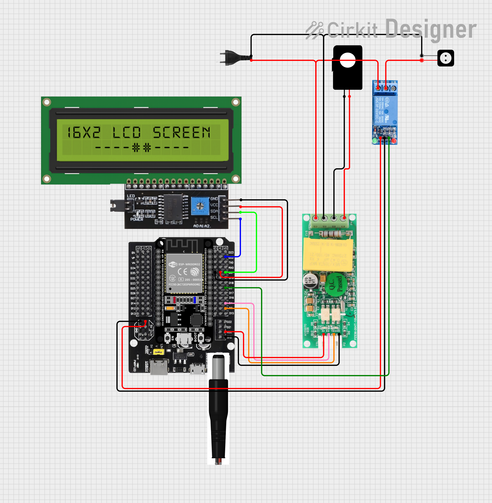

*Fig. 1 - Complete system wiring diagram (ESP32 + expansion board + LCD + relay + PZEM-004T)*

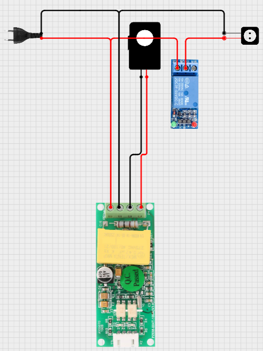

*Fig. 2 - Power supply circuit diagram (PZEM-004T + CT clamp + relay)*

---

## Hardware Components

### 1. ESP32 (Microcontroller)

| Spec | Value |
|------|-------|
| CPU | Dual-core Xtensa LX6, 240 MHz |
| Wi-Fi | 802.11 b/g/n |
| Bluetooth | 4.2 / BLE |
| ADC | 12-bit SAR, 18 channels |
| Interfaces | UART, SPI, I2C, PWM, ADC, DAC, CAN |
| Variant used | ESP32-DevKitC |

The ESP32 is the central processing node. It reads electrical parameters from the PZEM-004T via UART (Modbus RTU at address `0x01`), displays them on the LCD via I2C, controls the relay via GPIO5, and transmits all data to Home Assistant over Wi-Fi using the ESPHome API protocol.

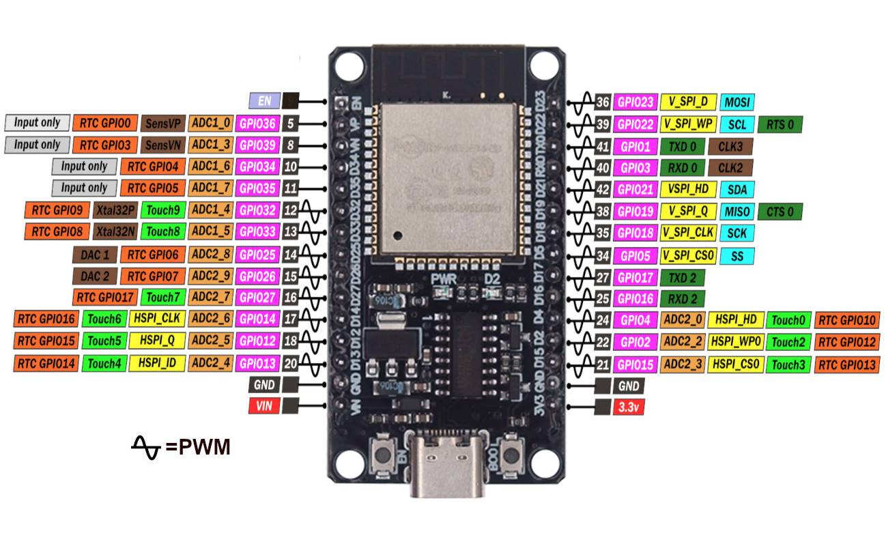

*Fig. 3 - ESP32-DevKitC GPIO pinout*

**Pin assignments used in this project:**

| GPIO | Function | Connected to |
|------|----------|-------------|
| GPIO16 | UART TX | PZEM-004T RX |
| GPIO17 | UART RX | PZEM-004T TX |
| GPIO21 | I2C SDA | LCD1602 SDA |
| GPIO22 | I2C SCL | LCD1602 SCL |
| GPIO5 | Digital OUT (open-drain) | Relay IN |

---

### 2. PZEM-004T (Energy Meter Module)

| Parameter | Range | Resolution |
|-----------|-------|------------|
| Voltage | 80–260 V AC | 0.1 V |
| Current | 0–100 A | 0.001 A |
| Active Power | 0–23 kW | 0.1 W |
| Active Energy | 0–9999.99 kWh | 1 Wh |
| Power Factor | 0.00–1.00 | 0.01 |
| Frequency | 45–65 Hz | 0.1 Hz |

- Connects directly to the 230V AC mains (L and N terminals)
- Current measurement is **non-invasive** via an external split-core current transformer (CT clamp)
- Communication: **Modbus RTU** over TTL UART (5V logic)
- Default Modbus address: `0x01`
- Optical isolation between the 230V side and the TTL signal side

| Pinout | Physical Module |
|--------|----------------|
| 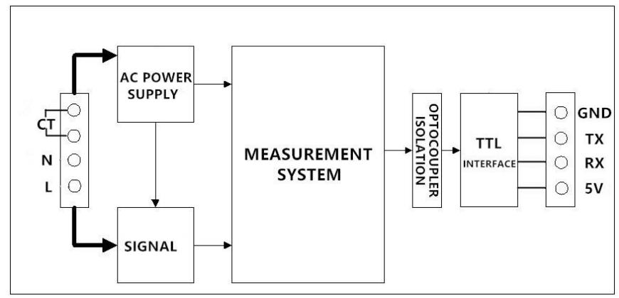 | 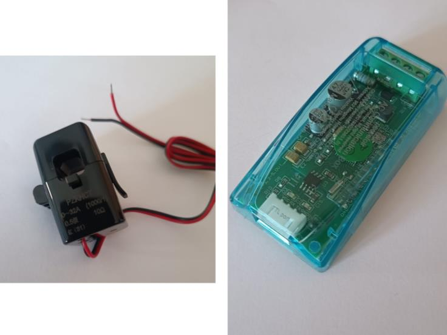 |

*Fig. 4 - PZEM-004T pinout (left) and physical module with CT clamp (right)*

---

### 3. ESP32 Expansion Board (ESP32S 30P)

- Breaks out all ESP32-DevKitC pins into GVS (GND–VCC–SIGNAL) connectors
- Selectable output voltage: 3.3V or 5V via jumper
- Power input: USB (5V) or external barrel jack (6.5–12V)
- Extended I2C interface groups (×2)

---

### 4. LCD1602A Display (16×2 Character LCD)

- Controller: HD44780 (or equivalent)
- Communication: **I2C** via PCF8574 backpack module (address `0x27`)
- Supply: 5V, LED backlight
- Pins used: SDA (GPIO21), SCL (GPIO22), VCC (5V), GND

The display alternates between two pages every 2 seconds:
- **Page 0:** Voltage (V), Current (A), Active Power (W)
- **Page 1:** Cumulative Energy (Wh), Power Factor

This provides a fully offline local readout - functional even when Wi-Fi or the server is unavailable.

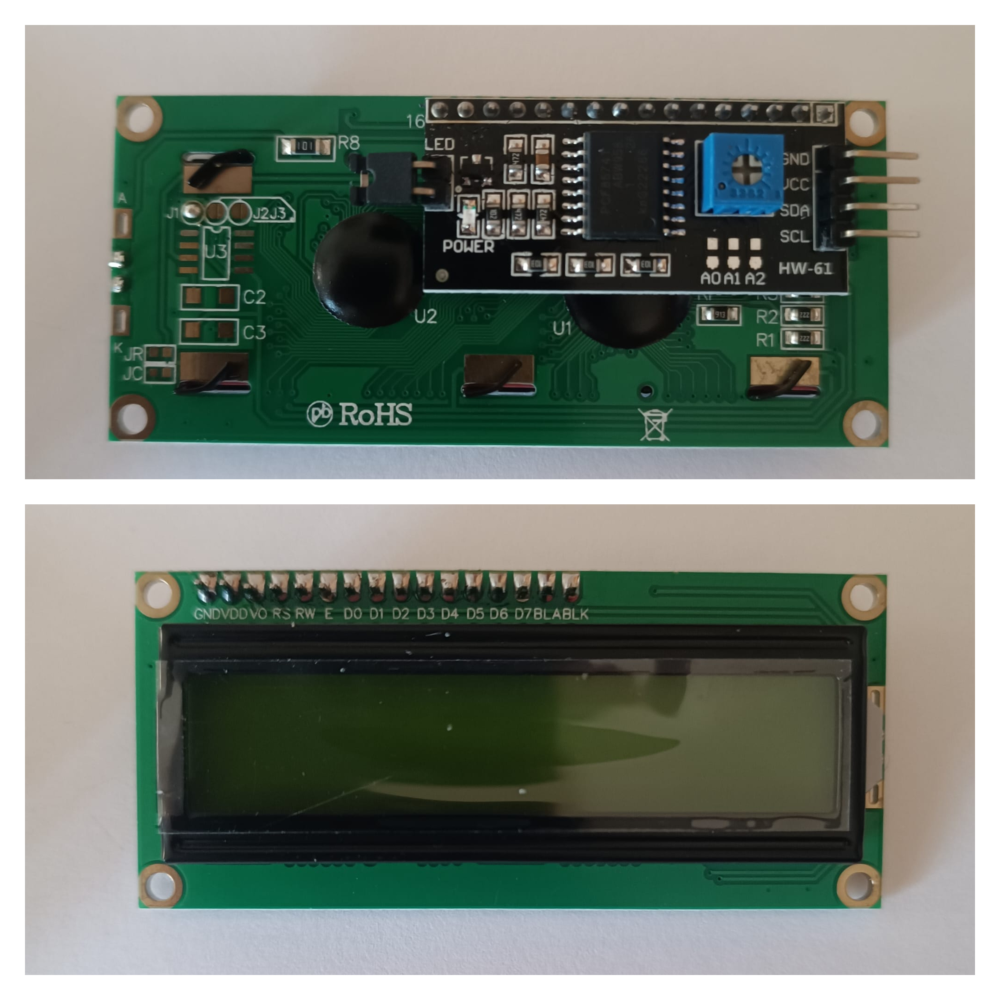

*Fig. 5 - LCD1602A physical module*

---

### 5. 5V Relay Module

| Spec | Value |
|------|-------|
| Coil voltage | 5V DC |
| Contact rating | 10A / 250V AC, 10A / 30V DC |
| Trigger logic | LOW (inverted, open-drain) |
| Isolation | Galvanic (electromagnetic coil) |

- Control pin: GPIO5 (configured as open-drain output, `inverted: true`)
- Output terminals: COM, NO (Normally Open), NC (Normally Closed)
- Used in NO configuration - load is disconnected at rest
- Visible in Home Assistant as a toggle switch entity

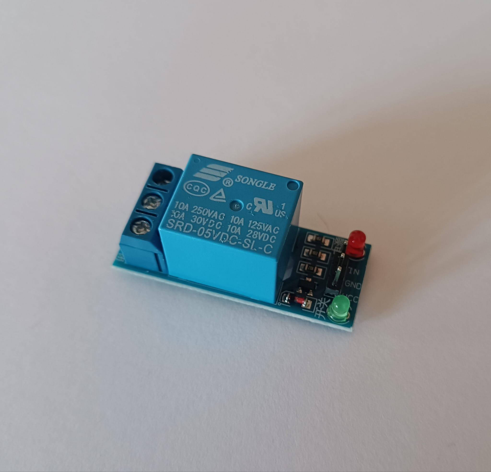

*Fig. 6 - 5V relay module*

---

### 6. Power Supply & Physical Assembly

| Component | Supply |
|-----------|--------|
| PZEM-004T | 230V AC (direct mains connection) |
| ESP32 + Expansion Board | 12V DC (barrel jack) |
| LCD1602 + Relay | 5V DC (from expansion board) |

The PZEM-004T is powered at 230V through the monitored extension cable, assembled with Wago wire connectors. The CT clamp is placed around the phase conductor. All components are mounted on an electrically isolated textolit board.

| Front Panel | Rear Panel |
|-------------|------------|
| 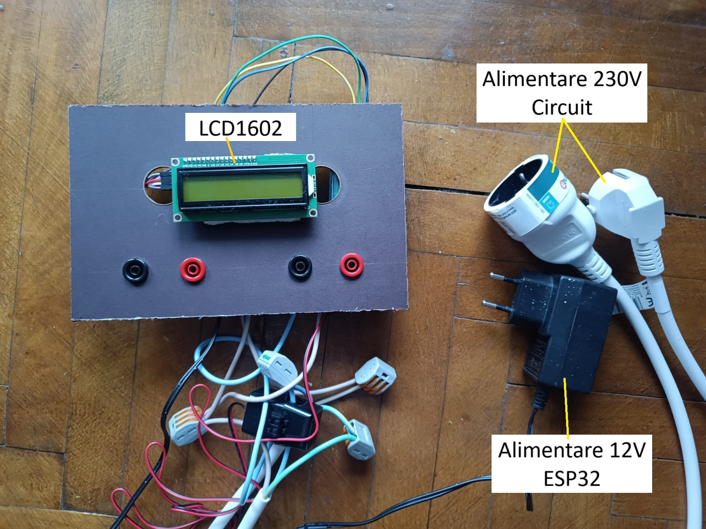 | 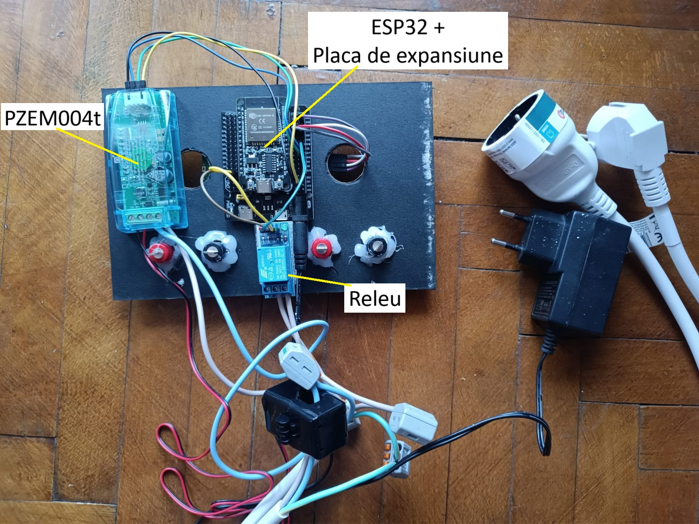 |

*Fig. 7 - Front panel with LCD1602 display (left) and rear panel with ESP32, PZEM-004T and relay (right)*

---

## Software Stack

| Component | Role | Version |
|-----------|------|---------|
| **ESPHome** | ESP32 firmware generation & OTA | Latest |
| **Home Assistant OS** | Central automation platform | 2025.3.4 |
| **InfluxDB** | Time-series database | (HA add-on) |
| **Grafana** | Data visualization & dashboards | (HA add-on) |
| **VMware Workstation Pro** | Hosts Home Assistant OS VM | - |

### Home Assistant OS

Runs as a virtual machine on VMware Workstation Pro. Acts as the central hub:
- Receives data from ESP32 via ESPHome API (AES-128 encrypted)
- Forwards all measurements to InfluxDB with precise timestamps
- Exposes the relay as a controllable switch entity
- Hosts the Grafana dashboard as an embedded webpage card

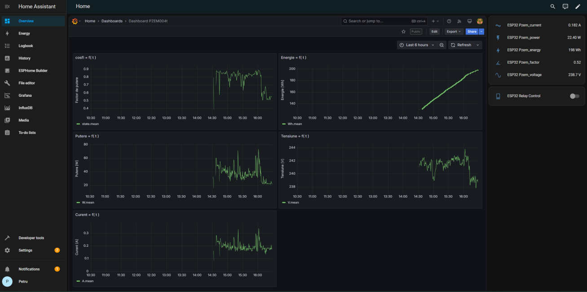

*Fig. 8 - Home Assistant dashboard with all PZEM entities and relay control*

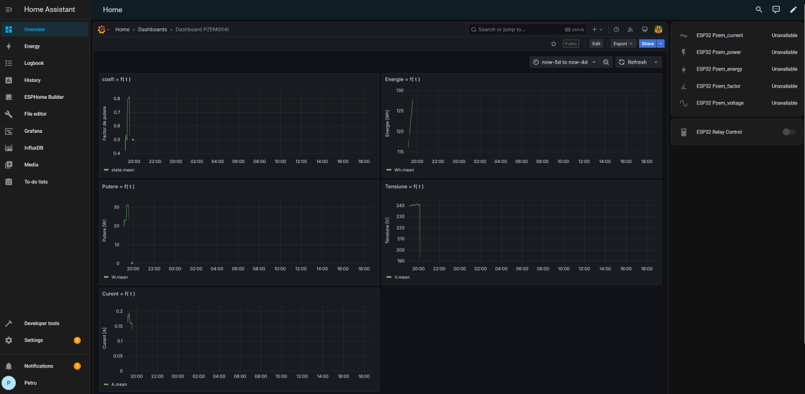

*Fig. 9 - Fully configured Home Assistant overview with Grafana graphs embedded*

### InfluxDB

- Time-series database optimized for high-frequency sensor data writes
- Each measurement (voltage, current, power, energy, power factor) stored with a Unix timestamp
- Update interval: **10 seconds**
- Retention policy: unlimited (configurable)
- Connected via Home Assistant InfluxDB add-on at port `8086`

### Grafana

- Connects to InfluxDB as data source (InfluxQL query language)
- Displays time-series graphs for all electrical parameters
- Configurable axis labels, min/max values, line types
- Alert thresholds configurable per panel

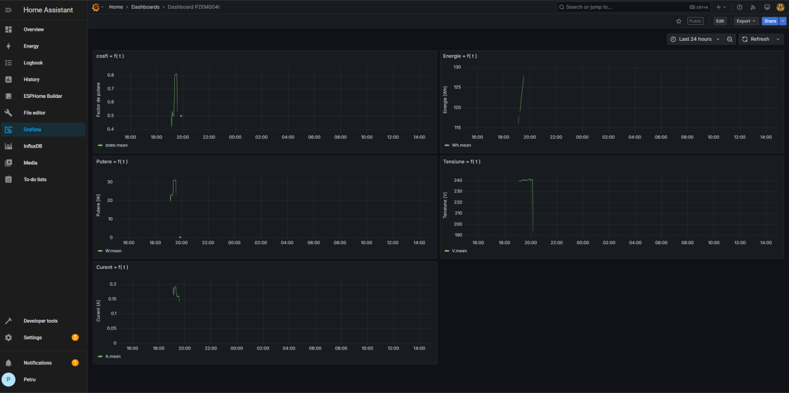

*Fig. 10 - Grafana dashboard showing historical data for all monitored parameters*

---

## Installation & Setup

### Prerequisites

- ESP32-DevKitC board
- PZEM-004T module + CT clamp
- LCD1602A with I2C backpack
- 5V relay module
- Home Assistant OS running (VM or Raspberry Pi)
- ESPHome add-on installed in Home Assistant

### Step 1 - Flash ESPHome firmware

1. Open Home Assistant → ESPHome
2. Create a new device named `esp32`
3. Replace the generated YAML with the configuration from [`esphome/esp32.yaml`](esphome/esp32.yaml)
4. Fill in your Wi-Fi credentials (`ssid` and `password`)
5. Click **Install** → **Plug into this computer** for the first flash
6. Subsequent updates via OTA

### Step 2 - Connect Hardware

Wire the components according to the pin table above:

```
ESP32 GPIO16 (TX) → PZEM-004T RX
ESP32 GPIO17 (RX) → PZEM-004T TX
ESP32 GPIO21 (SDA) → LCD1602 SDA
ESP32 GPIO22 (SCL) → LCD1602 SCL
ESP32 GPIO5       → Relay IN
ESP32 VCC (5V)    → PZEM-004T VCC, LCD VCC, Relay VCC
ESP32 GND         → PZEM-004T GND, LCD GND, Relay GND
PZEM-004T L/N     → 230V AC mains
CT clamp          → around phase conductor
Relay COM/NO      → series with load phase conductor
```

> ⚠️ **WARNING:** The PZEM-004T connects directly to 230V mains. Ensure proper electrical isolation. All 230V connections must be made by a qualified person following local electrical safety regulations.

### Step 3 - Configure InfluxDB

1. Install InfluxDB add-on in Home Assistant
2. Create a new database named `homeassistant`
3. Create a user `homeassistant` with admin privileges
4. Add to `configuration.yaml` (see [`homeassistant/configuration.yaml`](homeassistant/configuration.yaml))

### Step 4 - Configure Grafana

1. Install Grafana add-on in Home Assistant
2. Add InfluxDB as data source:
   - URL: `http://<your-ha-ip>:8086`
   - Database: `homeassistant`
3. Create a new dashboard and add panels for each sensor entity
4. Embed Grafana in Home Assistant via a Webpage card using the **Share externally** URL

---

## ESPHome Configuration (YAML)

Full configuration file: [`esphome/esp32.yaml`](esphome/esp32.yaml)

```yaml
esphome:
  name: esp32
  friendly_name: ESP32

esp32:
  board: esp32dev
  framework:
    type: arduino

safe_mode:
  reboot_timeout: 30s

# Enable logging
logger:

# Enable Home Assistant API (encrypted)
api:
  encryption:
    key: "axqMxLPU+xPoH+w9sTqE5bxoA7KF44mQ50mNo/ZPQ1s="

# OTA updates
ota:
  - platform: esphome
    password: "b82f21c36c3dcb3d5c744d9593302203"

# Wi-Fi connection
wifi:
  ssid: !secret wifi_ssid
  password: !secret wifi_password

# I2C bus for LCD
i2c:
  sda: 21
  scl: 22
  scan: True
  frequency: 300kHz

# Global variable for LCD page switching
globals:
  - id: lcd_page
    type: int
    restore_value: no
    initial_value: '0'

# Page switching interval: every 2 seconds
interval:
  - interval: 2s
    then:
      - lambda: |-
          id(lcd_page)++;
          if (id(lcd_page) > 1) id(lcd_page) = 0;

# LCD1602 display configuration
display:
  - platform: lcd_pcf8574
    dimensions: 16x2
    address: 0x27
    update_interval: 1s
    lambda: |-
      if (id(lcd_page) == 0) {
        it.printf(0, 0, "V:%.1fV I:%.2fA", id(pzem_voltage).state, id(pzem_current).state);
        it.printf(0, 1, "P:%.1fW", id(pzem_power).state);
      } else if (id(lcd_page) == 1) {
        it.printf(0, 0, "E:%.0fWh", id(pzem_energy).state);
        it.printf(0, 1, "PF:%.2f", id(pzem_power_factor).state);
      }

# UART for PZEM-004T (Modbus RTU at 9600 baud)
uart:
  tx_pin: 2
  rx_pin: 4
  baud_rate: 9600

# PZEM-004T sensors
sensor:
  - platform: pzemac
    address: 0x01
    voltage:
      name: "Pzem_voltage"
      id: pzem_voltage
    current:
      name: "Pzem_current"
      id: pzem_current
    power:
      name: "Pzem_power"
      id: pzem_power
    energy:
      name: "Pzem_energy"
      id: pzem_energy
    power_factor:
      name: "Pzem_factor"
      id: pzem_power_factor
    update_interval: 10s

# Relay switch (active LOW, open-drain)
switch:
  - platform: gpio
    name: "Relay Control"
    id: relay
    pin:
      number: GPIO5
      inverted: true
      mode:
        output: True
        open_drain: True

captive_portal:
```

### Configuration notes

- **`inverted: true`** - the relay activates on a LOW signal; open-drain mode ensures the pin is never driven HIGH, only pulled LOW or released
- **`address: 0x01`** - default Modbus address of PZEM-004T; change if multiple modules are used on the same bus
- **`update_interval: 10s`** - polling interval for all PZEM sensors; reduce for higher resolution (minimum ~1s)
- **`lcd_page`** global variable cycles between 0 and 1 every 2 seconds to show two pages of data on the 16×2 display
- Replace the `api.encryption.key` and `ota.password` with freshly generated values for your installation

---

## Results

### LCD Display

With no load connected, only voltage and cumulative energy are shown (current and power remain 0):

| No load | With load (laptop charger) |
|---------|---------------------------|
|  | 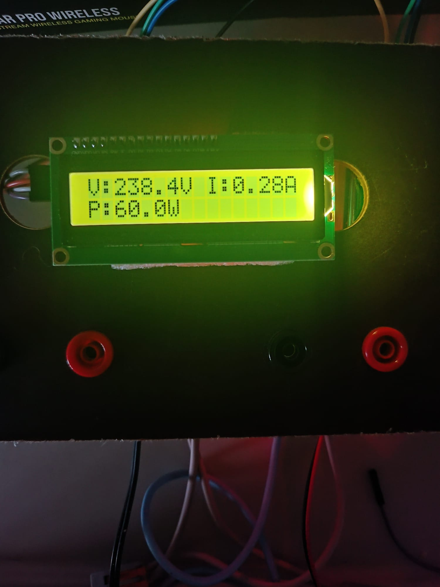 |
| 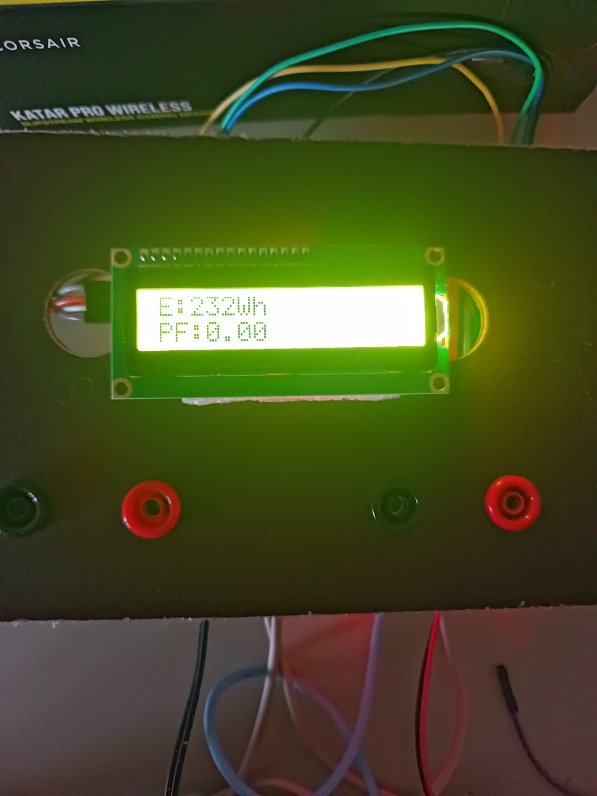 | 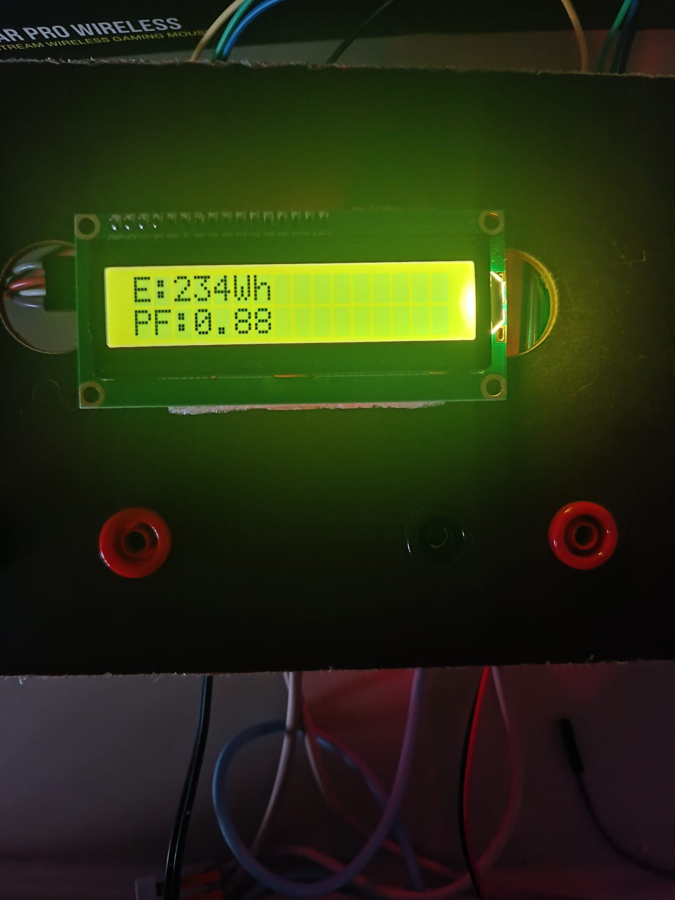 |

*Fig. 11 - LCD display: no load (left) vs. laptop charger connected (right). Page 0: V/I/P - Page 1: Energy/PF*

### Home Assistant - Real-time graphs

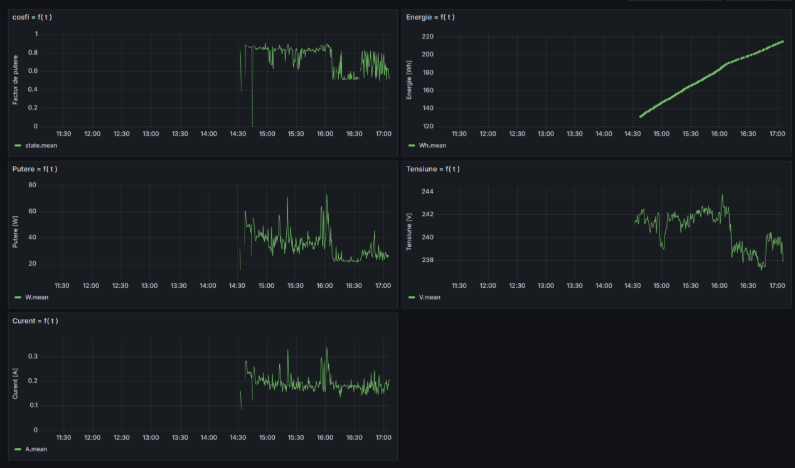

*Fig. 12 - Time-series graphs for power factor, energy, active power, voltage and current in Home Assistant*

### Relay Control

When the **ESP32 Relay Control** switch is toggled in Home Assistant, the circuit is interrupted and current, power and power factor return to 0. The relay LED indicator illuminates when active.

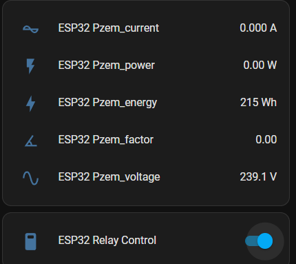

*Fig. 13 - Instantaneous values panel with relay toggle switch*

### Measured values - example with laptop charger load

| Parameter | Value |
|-----------|-------|
| Voltage | 238.4 V |
| Current | 0.28 A |
| Active Power | 60.0 W |
| Power Factor | 0.88 |
| Cumulative Energy | 234 Wh |

---

## Advantages & Limitations

### Advantages

- ✅ **Low cost** - total hardware under €50; all software is free and open-source
- ✅ **Local data control** - no cloud dependency; all data stays on the local network
- ✅ **Dual interface** - LCD works independently of Wi-Fi; web dashboard for remote access
- ✅ **OTA updates** - firmware updated wirelessly without physical access
- ✅ **Modular and extensible** - add more PZEM modules (different Modbus addresses), more sensors, or more relays with YAML-only changes
- ✅ **Scalable to 3-phase** - same hardware principle, add two more PZEM units and a 3-phase distribution board

### Limitations

- ⚠️ **PZEM-004T accuracy** - ±1% for voltage/power; adequate for energy management, not for billing-grade metering
- ⚠️ **Single-phase only** (this implementation) - 3-phase requires additional hardware
- ⚠️ **LCD character limit** - 16×2 display limits simultaneous parameter display; solved with page switching
- ⚠️ **Power supply dependency** - ESP32 and PZEM require stable supply; power fluctuations may affect measurement accuracy
- ⚠️ **Manual server setup** - Home Assistant + InfluxDB + Grafana stack requires initial technical configuration

---

## Conclusions

The system demonstrates that a fully functional industrial energy monitoring and control solution can be built with accessible, open-source components at a fraction of the cost of enterprise platforms (Schneider Electric EcoStruxure, Siemens SIMATIC).

The combination of ESP32 + PZEM-004T + ESPHome + Home Assistant + InfluxDB + Grafana provides:
- Real-time monitoring at 10-second resolution
- Persistent historical storage
- Remote circuit control
- Local offline display

**Future development directions:**
- Extension to 3-phase monitoring (3× PZEM-004T on separate Modbus addresses)
- Machine learning models for energy consumption forecasting (dissertation Report 2)
- Migration of the server to Raspberry Pi 5 for always-on operation (Report 2)
- DIN rail mounting for industrial cabinet integration (Report 2)
- TinyML on-device anomaly detection directly on ESP32

---

## Project Structure

```
.
├── README.md
├── LICENSE
├── esphome/
│   └── esp32.yaml
├── homeassistant/
│   └── configuration.yaml
├── docs/
│   └── images/
│       ├── Circuit_Diagram.png
│       ├── Power_Circuit.png
│       ├── Hardware_Front.jpeg
│       ├── Hardware_Back.jpeg
│       ├── ESP32_Pinout.jpg
│       ├── PZEM_Module.jpg
│       ├── PZEM_Pinout.jpg
│       ├── LCD_Display.jpg
│       ├── Relay_Module.jpeg
│       ├── HomeAssistant_Dashboard.png
│       ├── Grafana_Dashboard.png
│       ├── HomeAssistant_Configured_Dashboard.png
│       ├── LCD_Load_01.jpeg
│       ├── LCD_Load_02.jpeg
│       ├── LCD_noLoad_01.jpeg
│       ├── LCD_noLoad_02.jpeg
│       ├── HA_graphs.png
│       └── HA_relay_control.png
```

## References

1. IBM - Internet of Things: https://www.ibm.com/topics/internet-of-things
2. Espressif Systems - ESP32 Technical Reference Manual: https://docs.espressif.com/projects/esp-idf/en/v4.4/esp32/
3. PZEM-004T V3.0 Datasheet & User Manual: https://innovatorsguru.com/wp-content/uploads/2019/06/PZEM-004T-V3.0-Datasheet-User-Manual.pdf
4. ESPHome Documentation: https://esphome.io
5. InfluxData - InfluxDB: https://www.influxdata.com/
6. Grafana Labs: https://grafana.com
7. VMware Workstation Pro: https://www.vmware.com/products/workstation-pro.html
8. LCD1602A Datasheet: https://www.openhacks.com/uploadsproductos/eone-1602a1.pdf
9. ESP32S 30P Expansion Board: https://ssdielect.com/tarjetas-de-desarrollo/4499-esp32-30p-expansion-board.html
